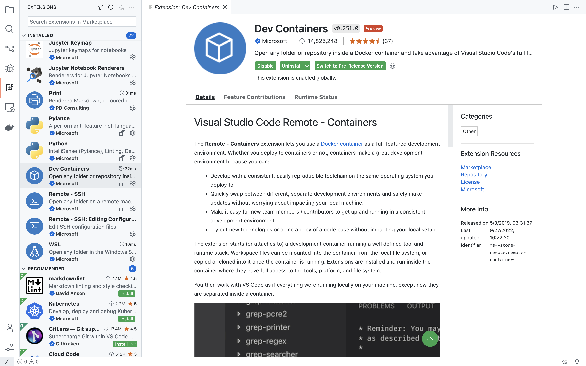
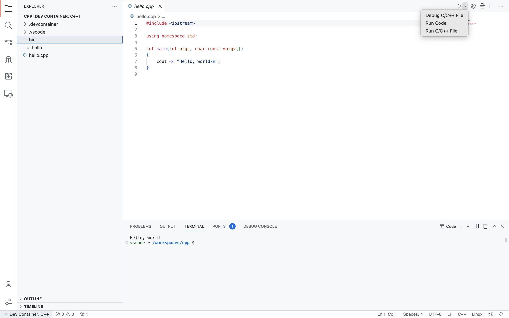

# Docker と VSCode で C++ 開発環境を構築しよう

このリポジトリには，[コンテナ](https://jpn.nec.com/cloud/service/container/about.html)開発環境を構築するためのコンフィグファイルが含まれています．なお，簡単にコンテナ開発環境を始めるための **Cpp Devcontainer Kit** （`cpp` フォルダ）も用意しています．このマニュアルは Cpp Devcontainer Kit を使ってコンテナ開発環境を構築・使用する方法を紹介します．最新の Cpp Devcontainer Kit は，リポジトリホームページの [Release](https://github.com/dleoliu/gsd20080-pub/releases) よりダウンロードできます．

コンテナ開発環境を使えば，講師または TA と同じ環境でプログラミングできます．なお，Microsoft 社が開発したエディタ [VSCode](https://code.visualstudio.com/) はを使えば，より簡単にコンテナ開発環境を構築・使用できます．

[Docker](https://www.docker.com/) コンテナについては，詳しくこちらの[ウィキペディアページ](https://ja.wikipedia.org/wiki/Docker)を参照できます．

このマニュアルは，PC／Mac 操作に詳しい人向けのものです．授業を受けるには，オンライン開発環境では十分で，コンテナ開発環境は必須ではありません．ただ，コンテナ開発環境を用意しておけば，自分のパソコンでも楽に受講・プログラミングできるでしょう．

---

**目次**

1. [Docker のインストール](#docker-のインストール)
2. [VSCode のインストール](#vscode-のインストール)
3. [コンテナ開発環境を始める](#コンテナ開発環境を始める)
4. [コンテナ開発環境の使用](#コンテナ開発環境の使用)

## Docker のインストール

ここでは，[Windows](#pcwindows) または [macOS](#macmacos) で Docker をインストールする方法を紹介します．

Windows で Docker を使うには，[WSL 機能](https://ja.wikipedia.org/wiki/Windows_Subsystem_for_Linux)が必要です．詳細は [Windows](#pcwindows) で確認してください．

### Mac(macOS)

公式のマニュアルは[こちら](https://docs.docker.com/desktop/install/mac-install/)．

1. 以下の要件を満たす Mac が必要です．最新バージョンの macOS へアップデートすればほぼのMacが以下の要件を満たすはずです．
    - Intel Mac
        - macOS バージョンが **10.15** 以上であること．
        - RAM が **4GB** 以上あること．
    - Apple Silicon Mac
        - Rosetta 2 がインストールされていること．ターミナルで以下のコードを入れればインストールできます．
            ```shell
            softwareupdate --install-rosetta
            ```
2. [公式ページ](https://www.docker.com/)からダウンロードされた `Docker.dmg` を開き，Docker をインストールしてから起動し，画面の提示に従って初期化します．ここで，Tutorial はスキップしても良いです．

### PC(Windows)

公式のマニュアルは[こちら](https://docs.docker.com/desktop/install/windows-install/)．

1. WSL を有効にします．WSLの有効化は[こちら](https://learn.microsoft.com/en-us/windows/wsl/install)の公式ページを参照してください（日本語版は[こちら](https://learn.microsoft.com/ja-jp/windows/wsl/install)）．

    デフォルトの状態で，これらのページにある **Install WSL command**（**WSL コマンドのインストール**）部分の操作のみを実行すれば十分です．

2. Microsoft Store で [Debian](https://apps.microsoft.com/store/detail/debian/9MSVKQC78PK6?hl=ja-jp&gl=jp) 及び [Windows Terminal](https://apps.microsoft.com/store/detail/windows-terminal/9N0DX20HK701?hl=ja-jp&gl=jp) をインストールします．

    両方ともインストールした後，Start から Debian を起動し，画面の提示に従ってユーザ名及びパスワードを設定します．
    
    Debian の初期化を完成した後，下記のコマンドを Debian で実行します．先ほど設定されたパスワードが要求されることがあり，途中で実行確認が行われる時にエンターキーを押せば良いです．

    ```shell
    sudo apt update
    sudo apt upgrade
    ```

    Debian は，広く使われる Linux Distro の一つで，初心者でも簡単に WSL で使えるのでここで Debian を選びます．

    **WSL 使用経験のある方**：どの Linux Distroを使っても良いので，自分の馴染みのものを Docker のバックエンドとして使えば良いです．

3. [公式ページ](https://www.docker.com/)からダウンロードされた `Docker Desktop Installer.exe` をダブルクリックしてインストールします．途中で Backend に関する選択肢が表示されるとき，**Use WSL 2 instead of Hyper-V** を選びます．

4. Docker のインストールが終わった後，Docker を起動し，画面の提示に従って初期化をします．ここで，Tutorial はスキップしても良いです．

## VSCode のインストール

VSCode を使えば，コンテナ開発環境の構築と使用ができます．VSCode のインストールと設定は，Mac と Windows の両方とも手順が同じです．

1. [こちら](https://code.visualstudio.com/)の公式ページで VSCode をダウンロードしてインストールします．

2. VSCode を起動し，左側の **EXTENSIONS** タブを開き，[Dev Containers](https://marketplace.visualstudio.com/items?itemName=ms-vscode-remote.remote-containers) を検索してインストールします．

    

## コンテナ開発環境を始める

1. リポジトリホームページの [**Release**](https://github.com/dleoliu/gsd20080-pub/releases) より最新の（latest）Cpp Devcontainer Kitをダウンロードし，解凍します．

    これで `cpp` フォルダが得られます．`cpp` フォルダに VSCode でコンテナ開発環境を構築・使用するためのコンフィグファイルが入っています．macOS ではこれらのファイルが Finder から見えないですが，VSCode で `cpp` フォルダを開ければ見えます．

2. VSCodeを起動し，「File - Open Folder」よりステップ１で得られた `cpp` フォルダを開きます．

    「Do you trust the authors of the files in this folder?」が表示されれば，「Yes, I trust the authors」を選びます．

3. `cpp` フォルダを開くと，VSCode ウィンドウの右下に開発コンテナのコンフィグファイルがあるというメッセージが表示されます．「**Reopen in Container**」を選ぶと，コンテナ開発環境が自動的に構築されます．ただ，初回の構築に時間がかかることがあります．

    

4. コンテナ開発環境の構築が完了した後，`hello.cpp` を開き，右上の `▷` を押すと，画面下部に実行結果の「Hello, world」が表示されたらコンテナ開発環境が正常に動いていることがわかります．

    画面の右上に `▷` が表示されず，虫ボタンが表示される場合，虫ボタンの右側の矢印をクリックし，「**Run Code**」をクリックすると右上の `▷` が出てきます．自分が作ったプログラムも `▷` ボタンを押すと実行できます．

    

## コンテナ開発環境の使用

コンテナ開発環境を用意できましたら，`cpp` フォルダで楽に C++ ファイルを作成したり実行したりできます．

`cpp` フォルダを再開するには，[コンテナ開発環境を始める](#コンテナ開発環境を始める)を参照して，VSCode で再度フォルダを開ければ使えます．ただ，初回以降は構築が必要でなくなるため，フォルダがより早く開けます．